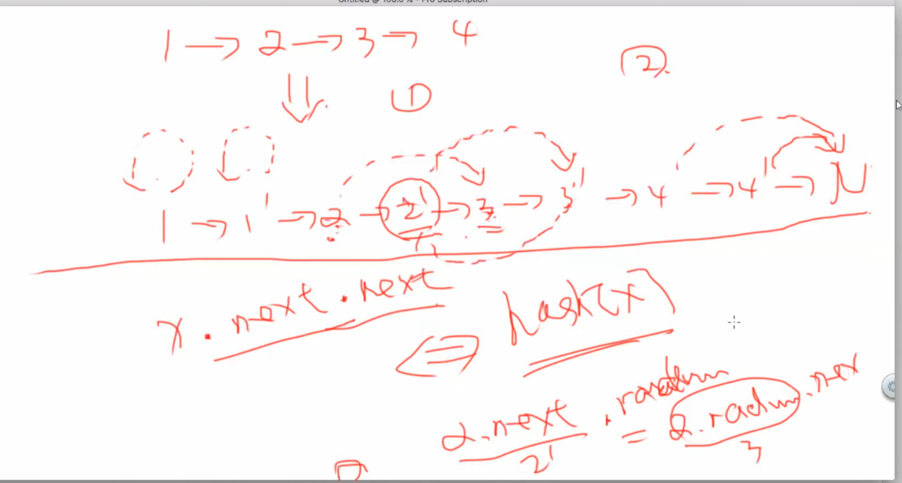

# Problem 138: Copy List with Random Pointer

## Description:

A linked list is given such that each node contains an additional random pointer which could point to any node in the list or null.

Return a deep copy of the list.

```python
# Definition for singly-linked list with a random pointer.
class RandomListNode(object):
    def __init__(self, x):
        self.label = x
        self.next = None
        self.random = None
```

## Key points & Thoughts:

* find all nodes
* copy nodes  - 新老节点之间要有映射关系
* copy edges \(neighbors\)

可以重新做一遍克隆graph

先想想这道题的难点在哪里，用O\(1\)的额外空间。

九章老师上课讲过，这道题需要特定的思路。




copy next, copy random, split.  


## Solution:

```python
"""
Definition for singly-linked list with a random pointer.
class RandomListNode:
    def __init__(self, x):
        self.label = x
        self.next = None
        self.random = None
"""


class Solution:
    # @param head: A RandomListNode
    # @return: A RandomListNode
    def copyRandomList(self, head):
        # write your code here
        self.copy_node(head)
        self.copy_random(head)
        return self.split(head)
                
    def copy_node(self, head):
        cur = head
        while cur:
            temp = cur.next
            new_node = RandomListNode(cur.label)
            new_node.next = temp
            cur.next = new_node
            cur = temp
        return head
        
    def copy_random(self, head):
        cur = head
        while cur:
            if not cur.random:
                cur.next.random = None
            else:
                cur.next.random = cur.random.next
            cur = cur.next.next
        return head
        
    def split(self, head):
        if not head: 
            return head
        cur_copy = new_head = head.next
        while head:
            head.next = cur_copy.next
            if cur_copy.next:
                cur_copy.next = cur_copy.next.next
            head = head.next
            cur_copy = cur_copy.next
        return new_head
        
    
            
            
```

